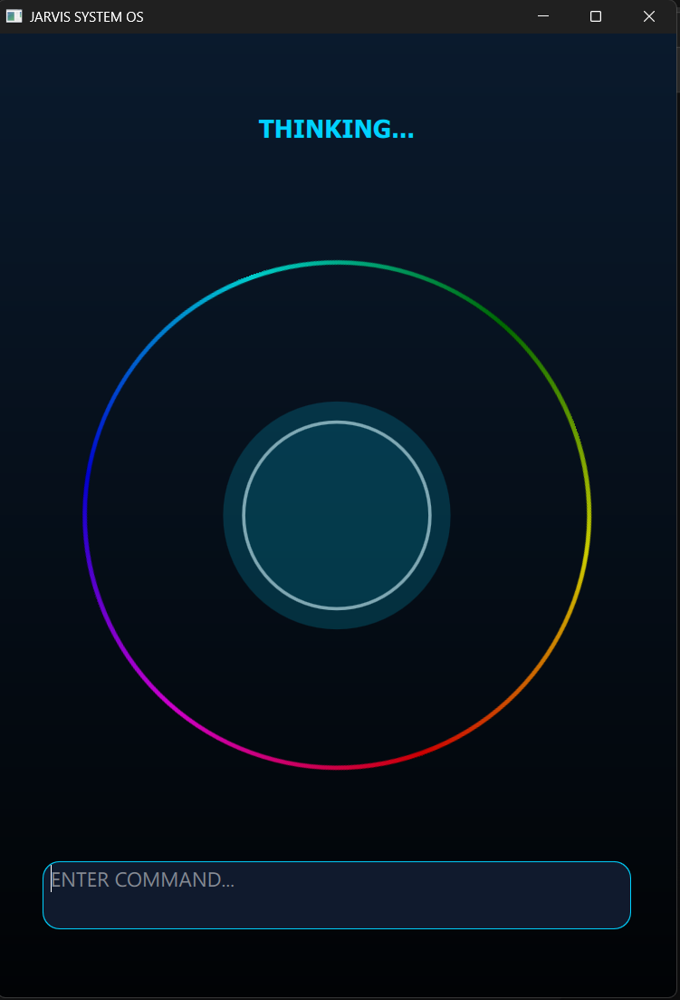

# JARVIS AI - MARK VII (Final Edition) 🚀

An advanced, holographic AI Assistant inspired by the **Iron Man** HUD system. This project integrates a sophisticated **Grid-based UI** with an **Autonomous AI Core** that learns and remembers your preferences.

## ✨ Final Version Features
- **Advanced HUD Interface**: A professional high-tech grid background with interactive holographic elements.
- **Dynamic Arc Reactor**: A multi-layered animated core that reacts to processing, listening, and speaking states.
- **Smart Memory System**: Uses a local JSON-based long-term memory to learn from user habits and technical preferences.
- **Diagnostic Mode**: Clean error handling that prevents system crashes and provides technical status updates.
- **Voice & Terminal Hybrid**: Seamlessly switch between voice commands and keyboard inputs.

## 🛠 Project Structure
- `main.py`: The system's central engine and bridge between AI and UI.
- `main.qml`: The holographic HUD design (Canvas & Animations).
- `ai_core.py`: The brain (Powered by GPT-4o / OpenRouter).
- `memory.py`: Persistent storage for learning and context.
- `voice_engine.py`: Audio processing for speech-to-text and text-to-speech.

## 🚀 How to Run
1. **Clone the project**:
   ```bash
   git clone [https://github.com/jedommo/JARVIS-AI-MARK-VII.git](https://github.com/jedommo/JARVIS-AI-MARK-VII.git)
Setup your API Key:
In ai_core.py, replace the api_key with your OpenRouter key.

Launch:

Bash
python main.py
📸 Final Interface Preview
⚖️ License
This project is open-source and intended for educational and creative purposes.

